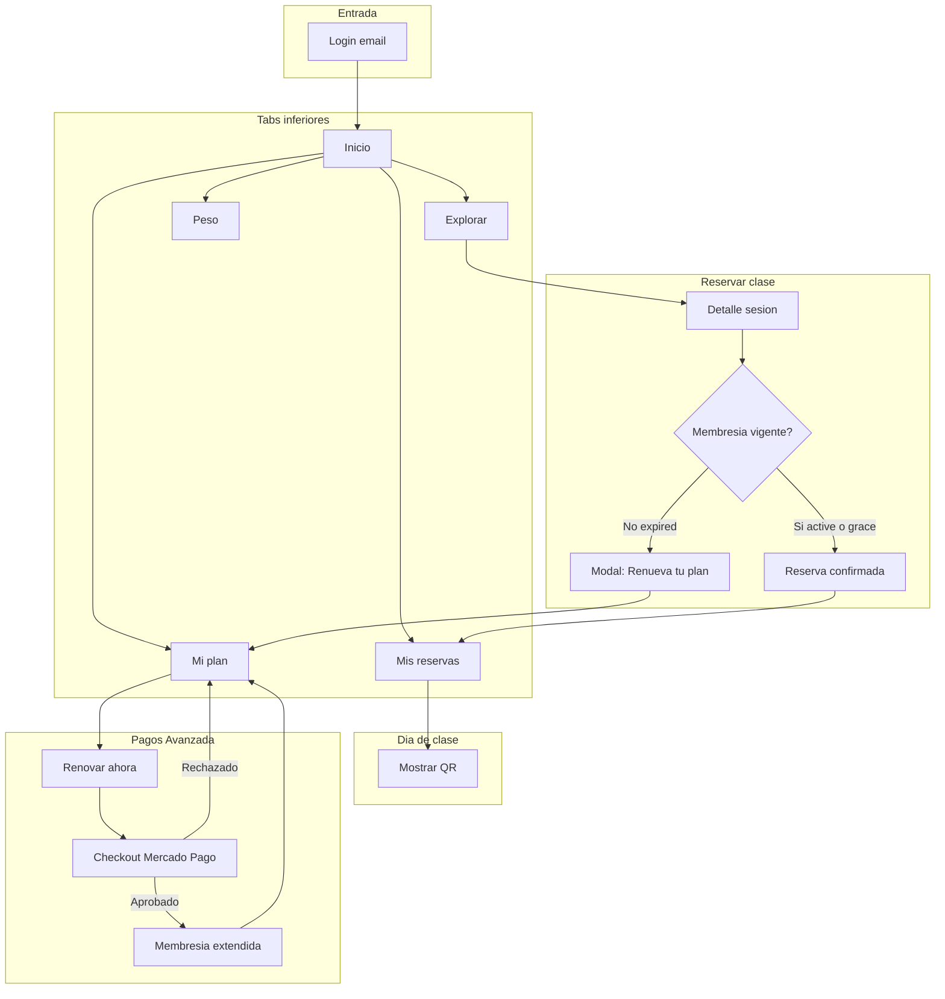
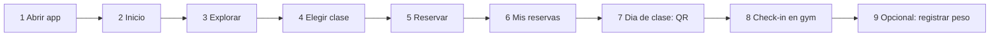
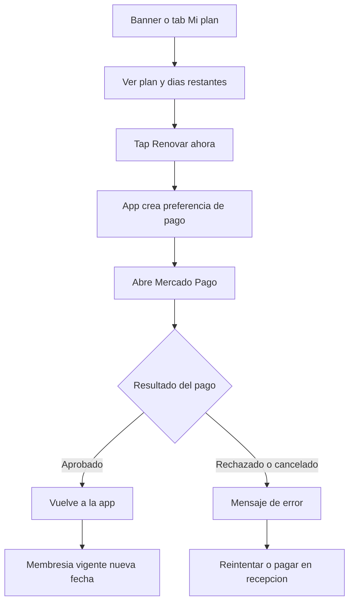
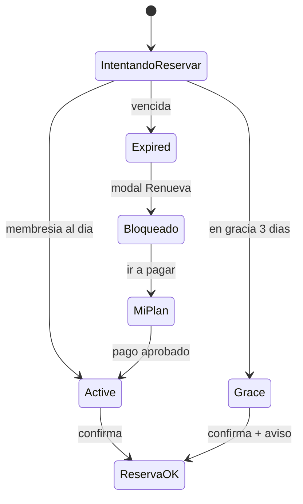
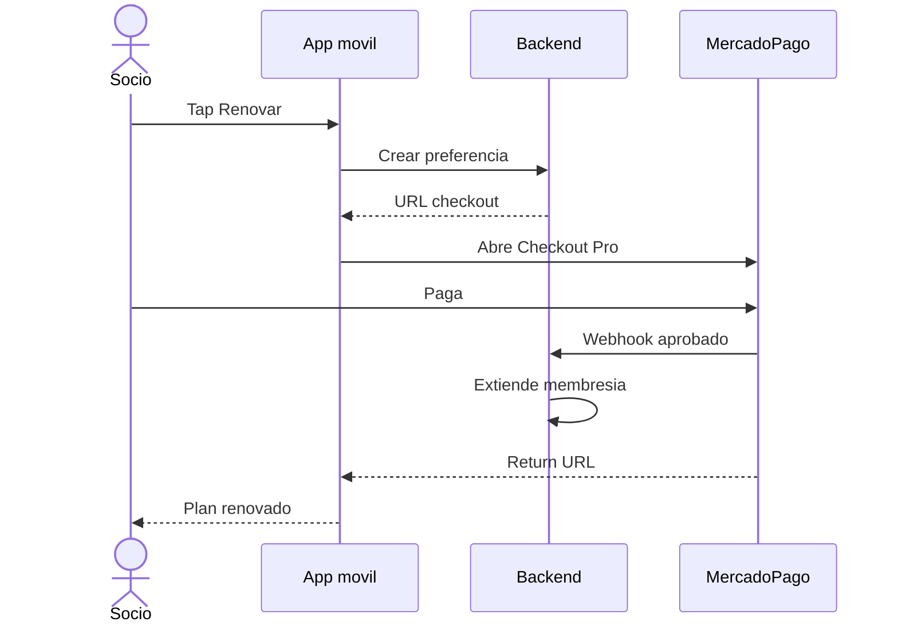
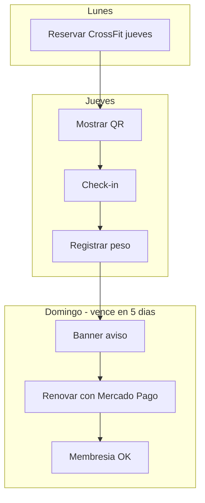

# Diagramas — App móvil socio

Flujos visuales para presentar al cliente.  
Abrí este archivo en Cursor / GitHub / VS Code con preview Mermaid.

Documento narrativo: [flujo-app-mobile.md](./flujo-app-mobile.md)

---

## Diagrama 1 — Mapa general de la app

---

## Diagrama 2 — Día típico (camino feliz)

---

## Diagrama 3 — Renovar membresía (Mercado Pago)

---

## Diagrama 4 — Gate de membresía al reservar

---

## Diagrama 5 — Secuencia renovar (técnico + producto)

---

## Diagrama 6 — Semana del socio

---

## Cómo verlos

1. **En Cursor:** abrir este `.md` → Preview (Ctrl+Shift+V) — Mermaid se renderiza.
2. **Al cliente:** exportar a PDF desde la presentación, o pegar capturas de cada diagrama.
3. **Imagen única:** ver `flujo-app-mobile-socio.png` en esta carpeta (si se generó).
