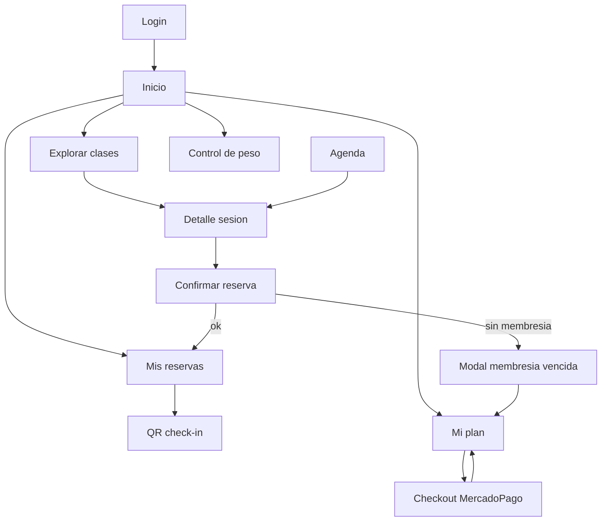
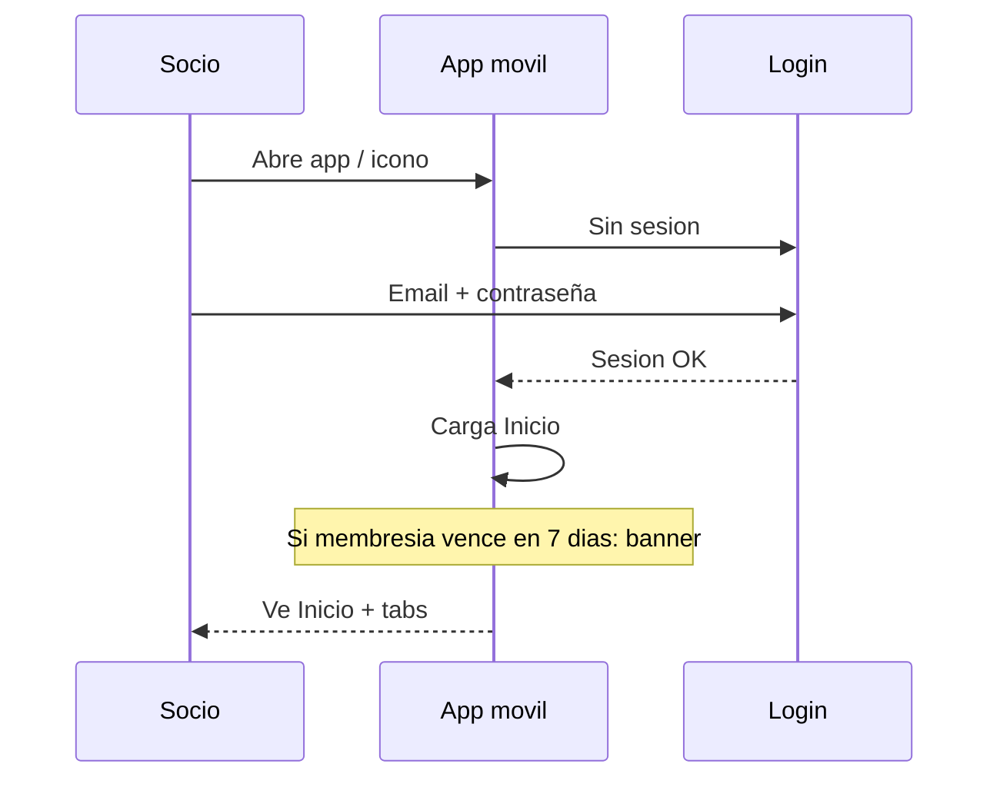
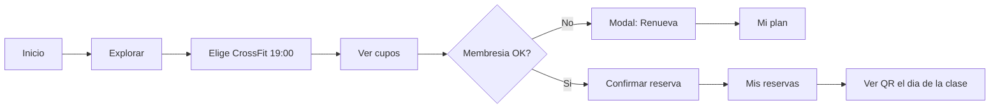
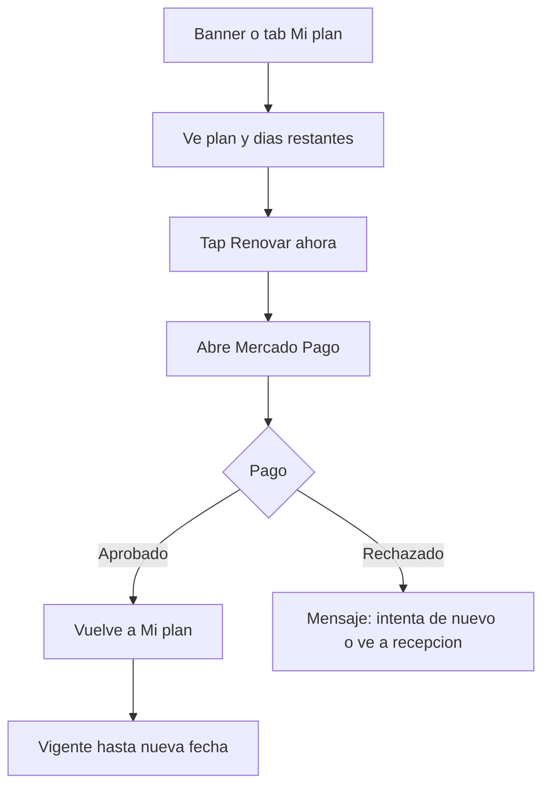

# Flujo funcional — App móvil (socio)

Cómo se usa ReservasGym Avanzada en el **celular del socio** (iOS / Android vía Capacitor, o PWA instalada).

Público: cliente del gym + QA.  
Documento narrativo: [flujo-app-mobile.md](./flujo-app-mobile.md)  
**Diagramas Mermaid:** [diagramas-app-mobile.md](./diagramas-app-mobile.md)

---

## 1. Qué es la app en el teléfono

Una sola app con **barra inferior de 5–6 pestañas**. El socio no ve el panel admin.

```
┌─────────────────────────────┐
│  [Banner vencimiento]       │  ← solo si aplica
│                             │
│      CONTENIDO DE LA        │
│         PANTALLA            │
│                             │
├─────────────────────────────┤
│ Inicio │Explorar│Reservas│  │
│  Plan  │  Peso              │
└─────────────────────────────┘
```

| Tab | Ruta | Para qué |
|---|---|---|
| **Inicio** | `/` | Resumen del día, próximas clases, acceso rápido |
| **Explorar** | `/explorar` | Buscar y reservar clases / áreas |
| **Agenda** | `/agenda` | Calendario día / semana / mes |
| **Reservas** | `/reservas` | Mis reservas, cancelar, QR check-in |
| **Mi plan** | `/membresia` | Membresía, renovar, pagos *(nuevo Avanzada)* |
| **Peso** | `/peso` | Control de peso e historial |

> En móvil, **Agenda** puede vivir dentro de Explorar o como tab; en la app actual existe como ruta. Para el socio el recorrido mental es: *ver qué hay → reservar → gestionar → pagar membresía*.

---

## 2. Mapa de pantallas móviles



---

## 3. Primer uso (onboarding corto)



**Pasos:**
1. Instala desde App Store / Play, o abre el link y “Añadir a inicio”.
2. Login (email / contraseña; en demo hay cuentas seed).
3. Llega a **Inicio** con logo y color del gym.
4. Si la membresía está por vencer → banner arriba: “Vence en X días — Renovar”.

---

## 4. Día típico del socio (camino feliz)

### 4.1 Reservar una clase



**Pantalla a pantalla:**

1. **Inicio** — “Hoy” / accesos: Explorar, Mis reservas, Mi plan.
2. **Explorar** — lista por área (Hyrox, CrossFit, Fisio…) o filtros.
3. **Detalle** — hora, instructor, aforo, botón **Reservar**.
4. Si membresía `active` o `grace` → confirma → toast “Reservado”.
5. Si `expired` → modal “Renueva tu membresía” → va a **Mi plan**.
6. En **Mis reservas** ve la clase; el día de la clase abre **QR** para check-in en recepción.

### 4.2 Ir a la clase (check-in)

1. Tab **Reservas**.
2. Tap en la reserva de hoy.
3. Muestra código QR / código numérico.
4. Staff escanea o ingresa el código → check-in OK.
5. (Opcional) Socio ve estado “Asistió”.

### 4.3 Registrar peso

1. Tab **Peso**.
2. “Nuevo registro” → kg (+ notas).
3. Historial con tendencia.

### 4.4 Renovar membresía desde el celular



**Pantalla a pantalla:**

1. Banner o tab **Mi plan**.
2. Tarjeta: nombre del plan, precio, “Válido hasta…”, barra de días, badge Activo/Gracia/Vencida.
3. **Renovar ahora** → loading “Preparando pago…”.
4. Se abre **Mercado Pago** (navegador in-app).
5. Paga con tarjeta / métodos MP.
6. Return a la app → “Membresía renovada hasta [fecha]”.
7. Historial muestra el pago Mercado Pago.

**Si no hay internet / MP caído:** mensaje “Paga en recepción”; el staff usa el panel de cobros.

---

## 5. Escenarios de membresía en móvil

| Situación | Qué ve el socio en el teléfono |
|---|---|
| Al día | Usa app normal; sin banner |
| Vence en ≤7 días | Banner amarillo + badge en Mi plan |
| En gracia (0–3 días post-vencimiento) | Banner urgente; **sí puede reservar** |
| Vencida | No puede reservar; modal → Mi plan; CTA Renovar |
| Pago fallido | Membresía igual; puede reintentar o ir a recepción |

---

## 6. Flujo completo “semana del socio” (resumen)

```
LUNES
  Abrir app → Inicio
  Explorar → Reservar CrossFit jueves 19:00
  (membresía OK)

JUEVES
  Reservas → mostrar QR
  Check-in en gym
  Peso → registrar 72.5 kg

DOMINGO (vence en 5 días)
  Banner: "Tu membresía vence en 5 días"
  Mi plan → Renovar → Mercado Pago → OK
  Banner desaparece
```

---

## 7. Qué NO hace el socio en el móvil

- No crea planes de membresía (eso es admin web).
- No cobra a otros socios.
- No edita marca del gym.
- No ve panel de ocupación admin.

El **staff** puede usar el mismo build en tablet/web para check-in y cobros; el recorrido “móvil socio” es el de arriba.

---

## 8. Wireframes de recorrido (orden de demos al cliente)

Al mostrar la app al cliente, recorrer en este orden:

1. Login → Inicio  
2. Explorar → Reservar  
3. Mis reservas → QR  
4. Peso (registro)  
5. Mi plan → estados Activo / Gracia / Vencida  
6. Renovar (mock o sandbox MP)  
7. Intentar reservar con membresía vencida → modal  

Detalle visual: [wireframes-socio.md](./wireframes-socio.md)

---

## 9. Criterios “la app móvil se siente completa”

- [ ] Tab bar usable con una mano (zonas inferiores)
- [ ] Renovar membresía en ≤4 taps desde Inicio
- [ ] Reservar clase en ≤5 taps
- [ ] QR legible a tamaño móvil
- [ ] Banner de vencimiento no tapa el CTA principal
- [ ] Offline: mensaje claro; cobro manual en recepción como fallback
