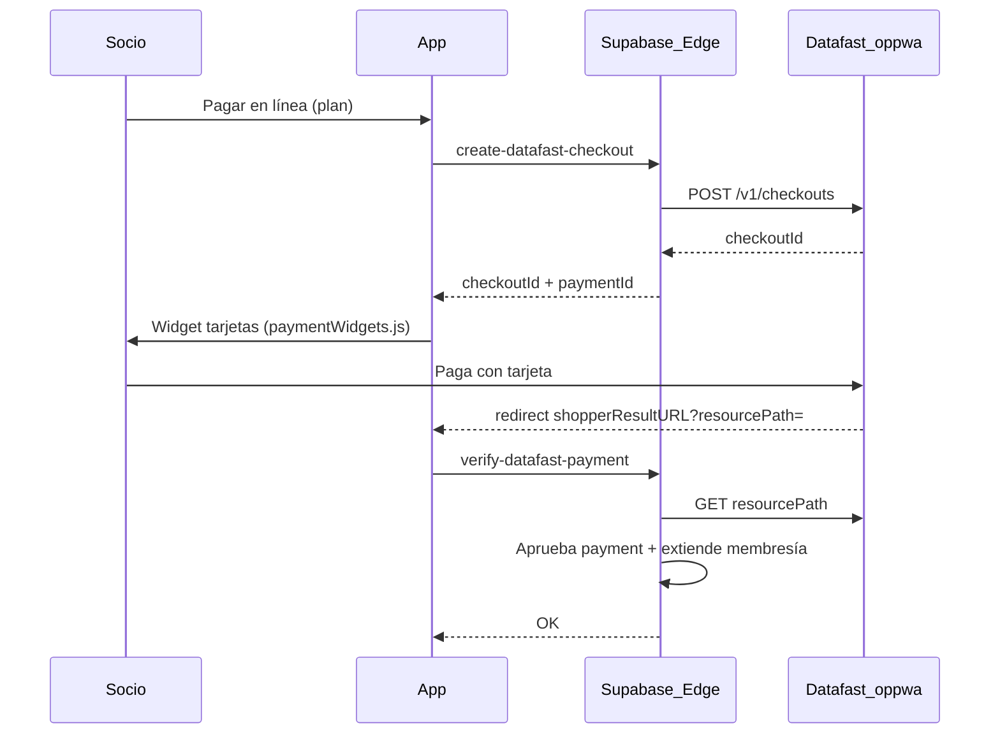

# Setup Datafast Dataweb — Zona Cero (Ecuador)

Pasarela **recomendada** para cobro online de membresías en Ecuador.
Dataweb = API + widget **COPYandPay** (PCI) sobre `oppwa.com`.

> Mercado Pago Checkout Pro **no** opera en Ecuador. Usar este documento.

---

## 1. Qué debe abrir el gym (comercial / banco)

El datáfono Datafast **físico no alcanza**: hay que activar **comercio electrónico / Dataweb** con el banco.

Pedir a Datafast / ejecutivo bancario:

| Dato | Uso |
|------|-----|
| `entityId` | Identificador de entidad (API) |
| Access Token (Bearer) | Cabecera `Authorization` |
| MID (`SHOPPER_MID`) | Código de comercio |
| TID (`SHOPPER_TID`) | Código de terminal |
| Ambiente test + prod | URLs distintas |

Contacto Datafast: https://www.datafast.com.ec · Developers: https://developers.datafast.com.ec/

---

## 2. Flujo técnico (COPYandPay)



1. `POST {base}/v1/checkouts` → `checkoutId` (caduca ~30 min)
2. Frontend carga `paymentWidgets.js?checkoutId=...` + form `shopperResultURL`
3. Tras pagar, Datafast redirige con `resourcePath=/v1/checkouts/{id}/payment`
4. `GET {base}{resourcePath}?entityId=...` → si código `000.000.*` / éxito → activar membresía

**Ambientes:**

| | Base URL | Widget script |
|--|----------|---------------|
| Test | `https://test.oppwa.com` | `https://test.oppwa.com/v1/paymentWidgets.js` |
| Prod | `https://eu-prod.oppwa.com` | `https://eu-prod.oppwa.com/v1/paymentWidgets.js` |

---

## 3. Secrets Supabase (Edge Functions)

```text
DATAFAST_ENTITY_ID=...
DATAFAST_ACCESS_TOKEN=...          # sin prefijo "Bearer " (la function lo agrega)
DATAFAST_MID=...                   # ej. test 1000000406
DATAFAST_TID=...                   # ej. test PD100406
DATAFAST_BASE_URL=https://test.oppwa.com
APP_URL=https://zona-cero-qa.vercel.app
```

Functions:

- `create-datafast-checkout` (JWT required)
- `verify-datafast-payment` (JWT required)

---

## 4. App (Vite)

```env
VITE_ONLINE_PAYMENTS=1
VITE_PAYMENT_PROVIDER=datafast
```

Rutas:

- `/membresia/pago?planId=` — datos del socio + widget
- Retorno: `/membresia/pago?resourcePath=...&paymentId=...`

---

## 5. Checklist

- [ ] Gym tiene Dataweb aprobado (no solo datáfono)
- [ ] Credenciales test recibidas
- [ ] Secrets en Supabase staging
- [ ] Functions desplegadas
- [ ] Pago test con tarjeta de pruebas Datafast → membresía activa
- [ ] Credenciales prod + `DATAFAST_BASE_URL=https://eu-prod.oppwa.com`
- [ ] Smoke cobro real mínimo

---

## 6. Relación con cobro en recepción

Sigue activo el panel **Cobros** (efectivo / transferencia / tarjeta POS).  
Online es canal adicional para el socio en **Mi Plan**.
