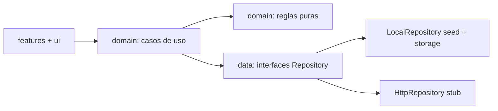

# Plan de desarrollo — ReservasGym

Documento de referencia técnica. Define el stack, la arquitectura, el modelo de datos, las reglas de negocio y las fases de construcción. **La aplicación todavía no está implementada**; este documento es el punto de partida.

---

## 1. Decisión de stack

Se construye una **aplicación web con TypeScript**, aplicando el lenguaje visual de las Human Interface Guidelines de Apple.

### Por qué web y no SwiftUI nativo

1. El requisito central es *responsive de verdad, de 320 px a escritorio, con tab bar en móvil y barra lateral en pantallas grandes*. Eso es un problema de web multi-viewport.
2. Una app web instalable (PWA) se distribuye sin pasar por App Store ni Google Play, sin cuotas de desarrollador y sin revisiones de tienda. Para el modelo comercial (ver [plan comercial](../comercial/plan-comercial.md)) esto es decisivo: reduce el tiempo de puesta en marcha de semanas a días.
3. Una sola base de código cubre el celular del socio, el computador de recepción, el panel de gerencia y el tótem de entrada. Con SwiftUI harían falta dos o tres proyectos.
4. La publicación nativa en tiendas sigue siendo posible como complemento comercial, envolviendo la PWA.

La estética sí sigue las HIG: jerarquía tipográfica clara, espaciado generoso, esquinas suaves, materiales translúcidos, profundidad sutil y microinteracciones con propósito.

### Tecnologías

| Capa | Elección | Motivo |
|---|---|---|
| Lenguaje | TypeScript en modo `strict` | Tipado estricto exigido por el alcance |
| Framework | React 19 | Ecosistema maduro y testing sólido |
| Build | Vite 7 | Arranque y recompilación rápidos |
| Estilos | Tailwind CSS v4 con `@theme` | Design tokens como variables CSS, tema claro/oscuro |
| Rutas | React Router v7 (declarativo) | Layouts anidados para móvil y escritorio |
| Estado | Zustand con `persist` | Simple, sin boilerplate; la persistencia vive tras la capa de datos |
| Pruebas | Vitest + Testing Library + jsdom | Mismo motor que Vite |
| Calidad | ESLint 9 (flat config) + Prettier | Lint y formato reproducibles |
| Animación | framer-motion | Microinteracciones, respetando `prefers-reduced-motion` |
| Iconos | lucide-react | Set coherente de trazo |
| Fechas | date-fns con locale `es` | Formato local de Ecuador |
| Moneda | `Intl.NumberFormat` | USD localizado |
| QR | `qrcode` | Generación del código de check-in en cliente |

---

## 2. Arquitectura por capas

```
src/
  app/         router, providers, layouts (tab bar movil / sidebar escritorio)
  ui/          design system: tokens.css + primitivos (Button, Card, Sheet, Skeleton...)
  features/    vistas por dominio funcional (auth, catalog, agenda, bookings, admin...)
  domain/      modelos y reglas de negocio puras (sin React, sin entrada/salida)
  data/        repositorios (interfaz) + adaptador local con seed + adaptador HTTP
  lib/         formato, localizacion, accesibilidad, hooks compartidos
  test/        configuracion y utilidades de prueba
```

**Regla dura: la vista no contiene lógica de negocio.** Los componentes llaman a hooks de `features/*`, que orquestan casos de uso de `domain` sobre repositorios inyectados por contexto. Cambiar `LocalRepository` por `HttpRepository` no debe tocar un solo componente.



---

## 3. Modelo de datos

`User` (rol member / staff / admin), `MembershipPlan`, `Membership`, `Trainer`, `Zone` (pesas, cardio, funcional, spinning, piscina, sauna, cancha, entrenamiento personal), `ClassTemplate`, `Session` (slot con `startsAt`, `endsAt`, `capacity`, `zoneId`, `trainerId`, `intensity`), `Booking` (estados `confirmed | pending | cancelled | attended | no_show`), `WaitlistEntry`, `CheckIn`, `RecurrenceRule`, `MaintenanceBlock`, `Routine`, `WorkoutLog`, `BodyMeasurement`, `BodyGoal`, `Review`, `Invoice`, `NewsPost`, `Favorite`, `NotificationItem`.

---

## 4. Reglas de negocio

Todas viven en `domain/rules/`, son funciones puras y tienen prueba unitaria.

- **Aforo.** Las reservas confirmadas no pueden superar `capacity`. Al llenarse, la siguiente solicitud entra en lista de espera con posición.
- **Lista de espera.** Al liberarse un cupo se promociona automáticamente al primero de la cola y se emite el aviso correspondiente.
- **Doble reserva y solapamiento.** Se rechaza si el intervalo se cruza con otra reserva activa del mismo socio.
- **Ventana de reserva.** La sesión abre `N` días antes y cierra al comenzar.
- **Ventana de cancelación.** Cancelación libre hasta `X` horas antes, configurable por plan. Después es cancelación tardía y computa como ausencia.
- **Permisos por membresía.** Plan activo, límite de reservas simultáneas y zonas o clases incluidas según el plan.
- **Check-in.** Válido entre 15 minutos antes y 10 después del inicio, mediante QR con token con caducidad. Sin check-in al finalizar, la reserva pasa a `no_show`.
- **Recurrencia.** Expansión de ocurrencias saltando bloqueos de mantenimiento y sesiones inexistentes, informando cuáles se omitieron.
- **Bloqueos de mantenimiento.** Invalidan las sesiones de la zona y disparan cancelación en cascada con aviso a los afectados.

---

## 5. Mapa de pantallas

**Onboarding y autenticación:** carrusel de bienvenida, inicio de sesión con email y contraseña, registro, e inicio de sesión con Apple (simulado mientras no haya backend).

**Aplicación del socio:** Inicio (próxima reserva, racha, accesos rápidos, noticias) · Explorar (buscador y filtros por tipo, instructor, día, franja, intensidad y duración) · Detalle de clase o zona con aforo · Agenda en vistas de día, semana y mes · Flujo de reserva (hoja de confirmación con política y recurrencia) · Mis reservas (próximas e historial, reagendar en un toque, cancelar, QR de check-in) · Entrenadores y valoraciones · Rutinas y progreso · Control de peso y medidas · Membresía y facturas · Noticias · Favoritos · Perfil y ajustes (tema, tamaño de texto, notificaciones).

**Panel de administración:** resumen de ocupación, CRUD de clases, sesiones, zonas, instructores y aforos, bloqueos por mantenimiento, gestión de reservas y lista de espera, y reportes de ocupación exportables.

**Navegación:** tab bar inferior con safe areas en móvil, barra lateral persistente desde el breakpoint `lg`, cabecera con material translúcido.

---

## 6. Accesibilidad y estados

Contraste AA verificado en ambos temas, objetivos táctiles de 44 px o más, tipografía escalable con preferencia de tamaño de texto, atributos `aria-*` y roles en componentes compuestos, navegación completa por teclado con foco visible y enlace de salto al contenido. Animaciones respetando `prefers-reduced-motion`.

Estados vacíos, esqueletos de carga, errores con reintento y modo sin conexión (detección de `navigator.onLine` con cola de acciones). Avisos no intrusivos como confirmación inmediata de cada acción. Toda la interfaz en español, con fechas, horas y moneda en formato de Ecuador.

---

## 7. Fases de construcción

La aplicación debe quedar ejecutable al final de cada fase, con un commit por cambio lógico.

1. **Base y sistema de diseño.** Scaffolding de Vite, ESLint, Prettier y Vitest; design tokens; primitivos de interfaz; layouts responsive; tema claro y oscuro; autenticación simulada.
2. **Dominio y datos.** Modelos, reglas, casos de uso, repositorios, seed realista (unas 8 zonas, 20 clases, instructores y de 3 a 4 semanas de sesiones) y pruebas de las reglas.
3. **Catálogo y calendario.** Explorar con filtros, detalle con aforo, agenda de día, semana y mes.
4. **Flujo de reservas.** Reservar, cancelar, reagendar, recurrentes, lista de espera, mis reservas y check-in con QR.
5. **Notificaciones y extras.** Centro de avisos y recordatorios locales, rutinas y progreso, control de peso y medidas, entrenadores y valoraciones, membresía y facturas, noticias y favoritos.
6. **Panel de administración.** CRUD completo, bloqueos por mantenimiento y reportes de ocupación.
7. **Cierre.** README de la aplicación, lint y pruebas en verde, y `pnpm build` sin errores ni advertencias.

---

## 8. Fuera de alcance

Backend real, notificaciones push desde servidor (se implementan Web Notifications y recordatorios locales), Sign in with Apple real, e internacionalización multi-idioma (la base queda preparada, pero solo se entrega español).

**Pasarela de pagos: excluida por decisión de producto.** El módulo de membresía muestra plan, vigencia y facturas, pero no procesa cobros. Se comercializa como complemento posterior según el [plan comercial](../comercial/plan-comercial.md).
