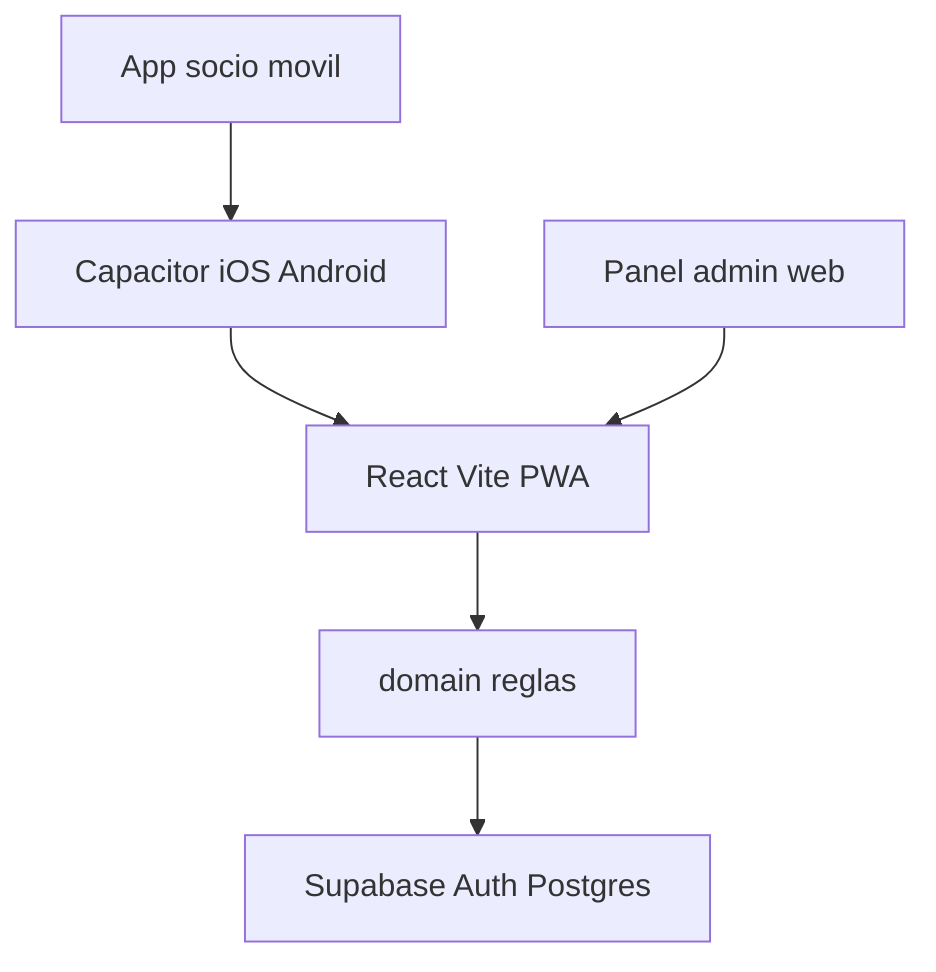

# Plan técnico — Intermedia ($4.500)

Documento de implementación del paquete comercial **Intermedia**. La app se entrega a un cliente real (p. ej. William Ramírez).  
Referencia comercial: [plan-comercial.md](../comercial/plan-comercial.md).  
Visión técnica amplia: [plan-de-desarrollo.md](./plan-de-desarrollo.md).

---

## 1. Alcance

### Incluye

- Reservas: registrar, cancelar, reagendar en todas las áreas:
  - Gimnasio (áreas con mayor seguimiento)
  - Fisioterapia, Nutrición, Bailoterapia
  - Áreas comunes
  - Hyrox (clases y preparación), Musculación, CrossFit (clases y preparación)
- Catálogo, agenda (día / semana / mes), aforo, lista de espera, check-in con QR
- Panel de administración (zonas, clases, cupos, ocupación)
- Marca del gym: logo, colores, nombre
- Link / web responsive (celular, tablet, escritorio)
- **Control de peso y progreso corporal** por cliente (CRUD + historial, socio y staff):
  - Peso (kg)
  - Medidas corporales (cm): cintura, cadera, pecho, brazo, muslo (opcionales por registro)
  - Estatura (cm) en el perfil del socio — necesaria para IMC
  - **IMC** calculado automáticamente (`peso / estatura²`)
  - **Metas** de peso (y opcionalmente de IMC): valor objetivo, fecha objetivo, estado
- **App publicada** en App Store y Google Play (Capacitor sobre la misma web)

### Fuera de alcance (Avanzada / Completa / complementos)

- Pagos y renovaciones de membresía
- Pasarela de cobros
- Facturación electrónica SRI
- Tienda / links de pago para productos
- Catálogo de productos e-commerce
- Multi-sede y tótem físico (upsells posteriores)
- Evaluación corporal avanzada: % grasa, masa muscular, fotos de progreso
- Integración con balanza (InBody, Tanita, etc.) o Apple Health / Google Fit

---

## 2. Stack

| Capa | Elección |
|---|---|
| Lenguaje | TypeScript `strict` |
| UI | React 19 + Vite 7 + Tailwind CSS v4 |
| Rutas | React Router v7 |
| Estado | Zustand |
| Pruebas | Vitest + Testing Library |
| Backend | Supabase (Auth + Postgres + RLS); adaptador local para demos/tests |
| Nativo | Capacitor (iOS + Android) |
| Fechas | date-fns (`es`) |
| QR | `qrcode` |

Arquitectura:

```
app/
  src/
    app/         router, providers, layouts
    ui/          design system
    features/    auth, catalog, agenda, bookings, weight, admin
    domain/      modelos y reglas puras
    data/        interfaces + LocalRepository + SupabaseRepository
    lib/         formato, hooks
  supabase/
    schema.sql   tablas + RLS de referencia
```



---

## 3. Modelo de datos (mínimo)

- `User` — roles: `member` | `staff` | `admin`
- `Zone` — tipo de área (gimnasio, fisio, nutricion, bailoterapia, comunes, hyrox, musculacion, crossfit)
- `ClassTemplate` / `Session` — cupo, horario, zona, instructor
- `Booking` — `confirmed | pending | cancelled | attended | no_show | waitlisted`
- `WaitlistEntry`, `CheckIn`, `Trainer`
- `BodyMeasurement` — registro periódico del socio:
  - `userId`, `recordedAt`, `recordedBy`, `notes?`
  - `weightKg` (obligatorio)
  - Medidas opcionales (cm): `waistCm`, `hipCm`, `chestCm`, `armCm`, `thighCm`
  - `heightCm` al momento del registro (copia de la estatura del perfil, o override puntual)
  - `bmi` — IMC calculado en dominio (no se edita a mano)
- `BodyGoal` — meta de progreso:
  - `userId`, `targetWeightKg`, `targetBmi?`, `targetDate?`, `status` (`active` \| `achieved` \| `cancelled`), `createdAt`, `createdBy`
- `GymSettings` — nombre, logo URL, color primario / acento, ventanas de reserva/cancelación/check-in

En `User` (perfil): `heightCm` persistente para calcular IMC en nuevos registros.

**No implementar en v1:** `Invoice` cobrable, pasarela, renovaciones, catálogo de productos; % grasa, masa muscular, fotos de progreso.

Seed inicial: las 8 áreas Intermedia con plantillas y sesiones de ejemplo (demo / gym de William).

---

## 4. Reglas de negocio

Funciones puras en `domain/rules/` con pruebas:

- Aforo: no superar `capacity`; exceso → lista de espera
- Waitlist: al liberar cupo, promover al primero
- Sin solapamiento de reservas activas del mismo socio
- Ventanas de reserva y cancelación configurables (`GymSettings`)
- Check-in QR válido ± ventana alrededor del inicio
- Peso / medidas: CRUD autorizado (socio sobre sí mismo; staff/admin sobre cualquier socio)
- IMC: se recalcula al guardar si hay `weightKg` y `heightCm` válidos; se rechaza si falta estatura
- Metas (`BodyGoal`): una meta `active` por socio a la vez; al alcanzar el peso objetivo (o al cerrarla el staff) pasa a `achieved` / `cancelled`

---

## 5. Fases de construcción

| Fase | Entregable | Criterio de hecho |
|---|---|---|
| 1 | Scaffold + design system + auth | Login/registro; layouts móvil (tab bar) y desktop (sidebar) |
| 2 | Dominio, repos, seed, tests | Reglas + `LocalRepository` / `SupabaseRepository` |
| 3 | Catálogo y agenda | 8 áreas; filtros; día/semana/mes |
| 4 | Reservas | Reservar, cancelar, reagendar, waitlist, QR, mis reservas |
| 5 | Control de peso | CRUD peso + medidas + historial; IMC; metas; socio y staff |
| 6 | Panel admin + marca | CRUD zonas/clases/cupos; ocupación; logo/colores |
| 7 | Capacitor + tiendas | Builds iOS/Android; checklist (cuentas del cliente) |

Cada fase deja la app ejecutable.

---

## 6. Backend

- **Producción:** Supabase. Variables: `VITE_SUPABASE_URL`, `VITE_SUPABASE_ANON_KEY`.
- **Demo / tests:** `LocalRepository` con seed en memoria / `localStorage` (modo por defecto si no hay credenciales).
- Schema SQL de referencia: [`app/supabase/schema.sql`](../../app/supabase/schema.sql).
- RLS: socio lee/escribe lo suyo; staff/admin gestiona catálogo, reservas y mediciones de todos.

---

## 7. Publicación en tiendas

Ver [`app/docs/store-checklist.md`](../../app/docs/store-checklist.md) (fase 7 / Capacitor). El cliente asume cuentas Apple Developer ($99/año) y Google Play ($25 único).

---

## 8. Estimación

- Web usable (fases 1–6): 6–8 semanas (1 dev).
- Tiendas (fase 7): +2–4 semanas (Apple depende de revisión).

## 9. Inputs del cliente (en paralelo)

Logo, colores, nombre del gym, listado de áreas/horarios, quién carga el peso (socio vs staff), y apertura de cuentas de tiendas.
